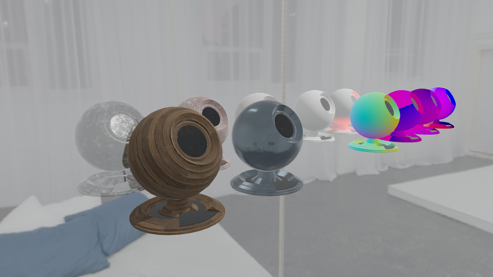
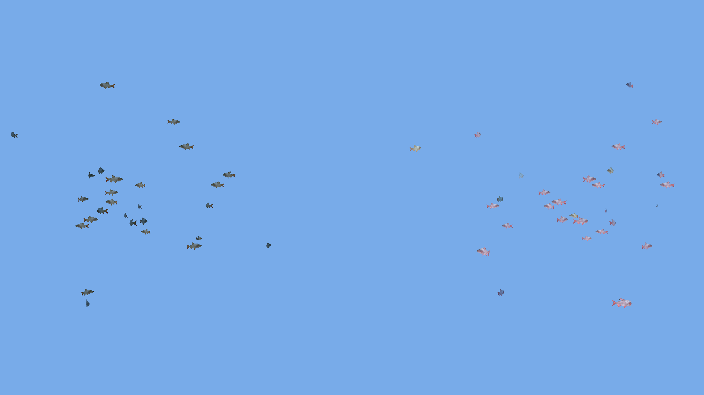

# Esnya Unity Shaders
Shader collection for Unity built-in shading. Tested with Unity 2018.4.20f1.

([Japanese](#Japanese))

## EsnyaPBR
Customized PBR shader, similar to Autodesk Interactive. It supports "wrong roughness correction" and advanced features of the Amplify Shader Editor such as refraction, transparency and translucency.

## Misc/Debug
Visualizes normals, UV1, UV2, and position.

## Misc/Occluder
Occludes everything behind.

## Misc/Meta
A metapass-only shader to provide static lighting.

## Osakana Shader

GPU particles of migrating small fish such as in an aquarium. See also [OsakanaShader/README.md](Assets/OsakanaShader/README.md).

---
---

# Japanese

## EsnyaPBR
Autodesk Interactiveに似たPBRシェーダー。おかしなRoughnessを補正したり、Amplify Shader Editorの高度な機能（屈折、Transmission、Translucency）をサポート。

## Misc/Debug
法線、UV1、UV2、座標を可視化。

## Misc/Occluder
後ろにあるものをすべて隠す。

## Misc/Meta
Static Lightingにのみ反映されるメタパスだけのシェーダー。

## OsakanaShader

回遊する小魚のGPUパーティクル。詳細は[OsakanaShader/README.md](Assets/OsakanaShader/README.md#Japanese)。

